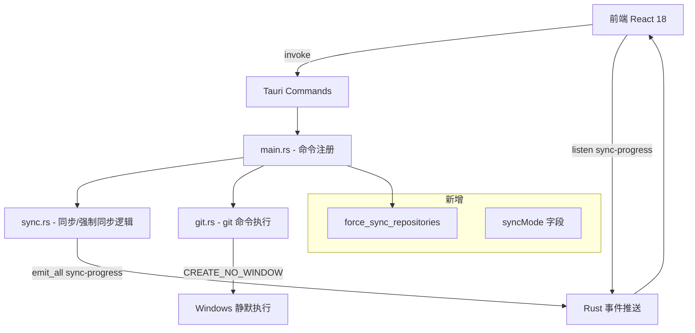

## 用户需求

基于已有 SyncDock（Tauri + React 18 + TypeScript 纯 CSS 项目）的修改意见和 Design Thinking 方案，对软件进行全面改版。

## 产品概述

SyncDock 是一款桌面端 Git 仓库批量同步管理工具，基于 Tauri v1 + React 18 + TypeScript。当前版本存在 CMD 弹窗干扰、操作无反馈、任务状态不更新、界面信息冗余、性能卡顿等核心问题，需系统性修复与重构。

## 核心功能改动

### 体验修复（优先级最高）

- **消除 CMD 弹窗**：所有 git 命令（clone、sync、refresh）在 Windows 下静默执行，不再弹出控制台窗口
- **添加加载/进度动画**：添加仓库、clone、刷新状态、同步全部/分组/单仓库等耗时操作均显示直观的进度或 loading 动画
- **任务状态修复**：同步任务完成后 `running` 状态正确切换为已完成，任务概览页同步跳转并展示执行动画

### 仓库页重构

- 工作区分组 Tab 最右侧添加"＋"按钮代替独立"新建分组"按钮
- 同步操作不再弹出 CMD 窗口，改为内联进度展示
- 新增**强制同步**（全部/分组/单仓库），以云端为主强制覆盖本地，避免被跳过
- 仓库卡片去掉路径显示，路径仅在详情页查看；分组显示去掉"组"前缀直接显示分组名
- 清单页搜索框、分组选择框、状态选择框改为同一行布局
- 清单页权限列改为全选 Checkbox，同步按钮缩小
- 日志 Tab 默认选中"全部日志"，再可切换到单仓库日志

### 任务页重构

- 同步全部/强制同步/分组同步触发后自动跳转到任务页，展示执行动画，逐条显示完成状态及对应日志
- 任务概览显示当前正在执行的仓库名及已完成条目
- 去掉重复的"运行摘要已迁移"提示文字、合并"仓库结果"与"任务详情"、删除"任务详情"独立 Tab
- 历史任务点击进入弹窗查看详情
- 历史任务日期显示格式修正为 `yyyy/MM/dd`

### 设置页改进

- 关于页增加"检查更新"按钮，检测到新版本时打开 GitHub releases 页面
- 同步模式从只读改为可选择，新增模式说明（Safe / Force / Rebase 等）
- 路径设置区将操作按钮移至对应路径显示值下方
- 关于页不展示配置目录和日志目录信息

### 全局优化

- 软件启动时显示加载动画，提升首屏体验
- 引入 shadcn/ui + Radix UI 组件库，替换纯 CSS 基础控件
- 所有页面仓库排序：有问题（失败/待同步）的排前面，正常的排后面
- 刷新状态逻辑修正：仅更新真实状态，不错误地将已同步仓库标记为跳过
- 软件图标换成猫咪站在小船上漂流的 SVG 意象图
- 性能优化：虚拟列表、日志分批渲染、减少阻塞调用

## 技术栈

- **前端**：React 18 + TypeScript，引入 shadcn/ui + Radix UI 替换基础控件
- **样式**：保留现有 CSS 变量体系，逐步接入 Tailwind CSS（shadcn 依赖）
- **后端**：Rust + Tauri v1（保持现有架构）
- **新增 Rust 依赖**：Windows 平台 `CREATE_NO_WINDOW` flag（通过 `std::os::windows::process::CommandExt`，无需新增 crate）

---

## 实现思路

### 第一阶段：Rust 后端修复（阻塞问题）

**1. 消除 CMD 弹窗**

`git.rs` 中 `run_command_with_cancel` 使用 `std::process::Command`，Windows 下默认继承父进程控制台窗口。修复方式：

```rust
// git.rs - Windows only
#[cfg(target_os = "windows")]
{
    use std::os::windows::process::CommandExt;
    const CREATE_NO_WINDOW: u32 = 0x08000000;
    command.creation_flags(CREATE_NO_WINDOW);
}
```

此修改一次性覆盖所有 git 命令（clone、fetch、pull、status），零误差，最小改动范围。

**2. 新增强制同步命令**

在 `sync.rs` 中新增 `force_sync_repositories` 函数，逻辑与现有 `sync_repositories` 相近，但跳过 `has_uncommitted_changes` / `has_untracked_files` / `detached_head` 的跳过判断，直接执行 `git fetch + git reset --hard origin/<branch>`。

在 `main.rs` 中注册新命令 `force_sync_repositories_command`，`api.ts` 对应增加 `forceSyncRepositories` 方法。

**3. 修正刷新状态逻辑**

当前 `refresh_repositories` 在仓库检查失败时会将 `last_sync_status` 残留为旧值，但 `status.status_text` 被覆盖。真正问题在于：刷新后前端仍用旧的 `lastSyncStatus` 决定 `tone`。需要在 `getRepositoryMeta` 中以 `status.syncRequired` / `status.repoHealthy` 为主要依据，而不是 `lastSyncStatus`。

**4. 新增同步模式字段**

`AppSettings` 增加 `syncMode: "safe" | "force" | "rebase"` 字段，`models.rs` 对应添加并设默认值 `"safe"`。

---

### 第二阶段：前端重构（UI/UX）

**组件库集成策略**：

- 通过 `npm install` 安装 `@radix-ui/react-*`、`shadcn/ui` 核心包
- 不做全量迁移，仅对改动最大的控件（Select、Checkbox、Dialog、Progress、Tooltip）使用 shadcn 组件，其余保留现有 CSS 类体系
- 这样可最小化改动范围，保持现有深色/浅色主题变量继续有效

**任务页动画**：

- 同步启动后立即 `navigateToView("tasks")` + `setTaskTab("overview")`
- 利用现有 `sync-progress` Tauri 事件驱动 UI，逐条渲染已完成仓库，配合 CSS transition 实现进入动画
- 正在执行的仓库用 spinner + 仓库名高亮显示

**性能**：

- 日志列表用 `react-window`（`FixedSizeList`）替换当前 `slice(0, 400)` 截断方式，支持无限滚动
- 仓库列表若超过 50 条，同样用虚拟列表

**启动加载动画**：

- `loading` 为 `true` 时展示全屏 SVG 动画（猫咪小船图标 + 淡入效果），替换现有纯文本 loading-panel

---

## 实现注意事项

- **CMD 弹窗修复是 Windows 独有问题**，`#[cfg(target_os = "windows")]` 条件编译，不影响 macOS/Linux 构建
- **强制同步的 `git reset --hard`** 是破坏性操作，前端必须加确认弹窗（使用 Radix AlertDialog）
- **shadcn/ui 集成**：项目当前使用 Vite，需先安装 `tailwindcss`、配置 `tailwind.config.js`，但仅在新组件中使用 Tailwind，旧 CSS 保持不变，防止样式冲突
- **`syncMode` 字段向后兼容**：`AppSettings` 的 `#[serde(default)]` 已有，新字段加 `#[serde(default = "default_sync_mode")]` 即可，老配置文件无需迁移
- **历史任务详情弹窗**：复用现有 `Modal` 组件，传入 `selectedTask` 渲染，避免新增路由
- **任务 `running` 状态修复**：`finalize_task` 中已正确设置 `running = false`，问题在于前端 `mergeTasks` 和 `activeTask` 判断；需确认 `sync-progress` 最终事件（`running: false`）后正确更新 `syncTask` 状态
- **日志分批渲染**：用 `react-window` 替换 `.slice(0, N)` 硬截断，避免大日志文件阻塞渲染

---

## 架构设计



---

## 目录结构

```
d:/gitHub/SyncDock/
├── src/
│   ├── App.tsx                  # [MODIFY] 主前端文件（2981行）
│   │                            # - 消除分组页"新建分组"按钮，改为 Tab 右侧"+"
│   │                            # - 同步/强制同步触发后跳转任务页+动画
│   │                            # - 任务页去掉冗余Tab，历史任务详情改弹窗
│   │                            # - 清单页布局调整（搜索/分组/状态同行）
│   │                            # - 添加仓库弹窗：自动填充名称、分组下拉、备注间距
│   │                            # - 关于页去掉路径信息，增加检查更新按钮
│   │                            # - 设置页同步模式改为可选 select
│   │                            # - 启动加载动画替换文字 loading
│   │                            # - 日志Tab默认全部日志
│   │                            # - 引入虚拟列表（react-window）
│   ├── api.ts                   # [MODIFY] 新增 forceSyncRepositories API 方法
│   ├── types.ts                 # [MODIFY] AppSettings 增加 syncMode 字段；SyncMode 类型
│   ├── styles.css               # [MODIFY] 新增任务动画、加载动画、强制同步样式、
│   │                            #           分组Tab"+"按钮样式
│   └── main.tsx                 # [NO CHANGE]
│
├── src-tauri/src/
│   ├── git.rs                   # [MODIFY] run_command_with_cancel 增加 Windows
│   │                            #   CREATE_NO_WINDOW 标志，消除所有 CMD 弹窗
│   ├── sync.rs                  # [MODIFY] 新增 force_sync_for_repo 逻辑（跳过保护
│   │                            #   检查，执行 git fetch + git reset --hard）
│   │                            #   新增 force_sync_repositories 入口函数
│   ├── models.rs                # [MODIFY] AppSettings 增加 sync_mode 字段
│   ├── main.rs                  # [MODIFY] 注册 force_sync_repositories_command 命令
│   └── storage.rs               # [NO CHANGE]
│
├── src-tauri/tauri.conf.json    # [MODIFY] 更换软件图标为猫咪小船 SVG
├── src-tauri/icons/             # [MODIFY] 新增猫咪小船 SVG/PNG 图标文件
└── package.json                 # [MODIFY] 新增 react-window、@radix-ui 等依赖
```

## 使用的 Agent 扩展

### SubAgent

- **code-explorer**
- 用途：在实施各阶段前，对 `src/App.tsx`（2981行）、`src-tauri/src/sync.rs`、`src-tauri/src/git.rs` 中的具体函数位置、组件边界、状态流向进行精准定位，避免大文件盲改
- 预期结果：精确返回每个改动点的行号范围、受影响的状态变量名和组件名，确保修改精准无遗漏